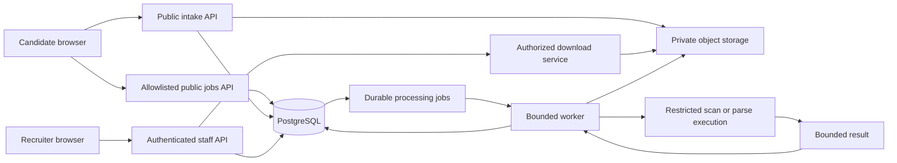

# ADR-001: Portable foundations for Agora's recruitment platform

| Field | Value |
| --- | --- |
| Date | 2026-09-21 |
| Revision | 3: final consolidated architecture, including review amendments and safe-delivery gates |
| Status | Accepted; implementation pending |
| Accepted on | 2026-09-21, by the product owner in this conversation |
| Amendments | Database-backed roles/permissions; early privacy gate; merge consistency; bounded retries; atomic worker publication; public job disclosure; execution isolation |
| Scope | Data ownership, authorization, submissions, documents, portability, recovery, and delivery |
| Decision owners | Agora product owner and technical maintainer |
| Supersedes | Earlier informal proposals where they conflict with this record |

Architecture approval does not mean the design is implemented or the operational gates in section 17 are satisfied. Those gates remain prerequisites for the production capabilities they govern.

Revision 3 incorporates the requested review amendments. It preserves the accepted architecture rather than introducing a new platform. Numeric operating policies explicitly marked proposed still require confirmation and evidence. The companion [safe implementation plan](agora-implementation-plan.md) sequences the work; this ADR defines the decisions and invariants.

## 1. Context

Agora is a recruitment agency. Its public Next.js website lists jobs and accepts applications with PDF or DOCX CVs. Vercel hosts the application; Supabase provides PostgreSQL and private file storage. The local implementation uses NextAuth with GitHub OAuth for optional candidate prefill.

The inspected submission route validates input, uploads a CV, inserts one `public.applicants` row, and attempts file cleanup if the insert reports an error. Jobs are currently defined in source code. The existing model combines a person, an application, and a CV reference in one row. It cannot adequately represent repeated applications, reviewed identity, CV reuse, recruiter workflows, or durable candidate sourcing.

The target is a small internal applicant tracking system and talent CRM for Agora recruiters. Candidates must remain useful beyond one application. Initial expected scale is hundreds of jobs and thousands to tens of thousands of candidates. Low operating cost, maintainability, and data portability are priorities.

Evidence boundary: local source was inspected for this ADR. Production deployment, remote schema, bucket contents, permissions, and backup configuration were not verified. The owner previously identified existing rows as test data; that must be rechecked at cutover. PR #1 was reported merged, but this does not establish which deployment is live.

## 2. Confirmed requirements

- One recruitment agency initially; candidates and clients have no accounts in the initial release.
- Invited, authorized recruiters manage clients, jobs, candidates, applications, notes, tasks, and tags.
- Include agency-scoped roles and explicit permission grants in the initial database model, with one role per agency membership. A custom-role editor can follow later.
- A candidate may exist without an application and may apply to multiple jobs, including potentially reapplying to one job.
- Candidate sources include public applications, manual uploads, referrals, imports, and later Telegram.
- A job belongs to a client, whose identity may remain confidential in the public listing.
- Initial stages are Review, Initial screen, Interview, Offer, Hired, and Rejected; stages can change.
- Identical CVs should be reused where candidate identity is established; distinct CV versions must remain traceable.
- Duplicate candidates are suggested to recruiters for confirmation or rejection. Uncertain matches do not trigger automatic merges.
- Search starts with keywords, tags, and structured filters; natural-language retrieval is a later feature.
- Only permitted recruiters can download CVs.
- The business wants a long-lived talent pool and currently proposes a one-year retention review horizon. Applicable purpose, retention, and deletion rules remain to be established.

## 3. Architecture decision

Use one modular Next.js application, one PostgreSQL database, private object storage, and one bounded background worker. Keep Supabase initially. Use PostgreSQL for relational data, transactions, initial search, and durable processing jobs.

Choose application-owned UUIDs, SQL migrations, a private `app` database schema, narrow provider integrations, and restore tests. Run business database migrations independently of Supabase provisioning. Do not introduce a second storage implementation, a separate search cluster, Redis, Kafka, or a microservice platform during the initial release.

The public website, recruiter interface, and worker share domain rules but use different runtime privileges. A browser does not receive database or administrative Storage credentials. A worker is a separately scheduled execution responsibility, not necessarily another always-on paid service; deployment and resource limits must be proven before enabling it.



## 4. Organization and authorization

Seed one organization, Agora. Tenant-owned business records carry a non-null `organization_id`. Include two-organization test fixtures from the beginning. No self-service organization signup, billing, or tenant provisioning is included.

Initially, active recruiters can see all unrestricted candidates within Agora. Recruiter ownership means work assignment, not confidentiality. Restriction/deletion status can remove a record from ordinary access. Team-specific or confidential-candidate access requires a later explicit decision.

Retain NextAuth initially, subject to verifying a suitable supported version and an enforceable staff MFA setup before production access. Map verified provider subjects to internal users through `auth_identities`. Use stable provider IDs, not an email or mutable username. Candidate OAuth prefill conveys no staff membership. Do not migrate to Supabase Auth merely to normalize the database.

Every staff request resolves an active internal user, organization membership, and assigned role. Membership and the required permission grants are checked for sensitive requests, including search, exports, downloads, and writes. Revoking membership or changing grants affects subsequent authorization checks without requiring a new login. Identity linking requires an authenticated recovery/linking procedure. OAuth access tokens should not be retained unless an integration needs them.

Seed organization-local Admin, Recruiter, and Viewer roles. The following is the initial grant matrix, subject to the explicit Viewer activation gate below; role names are display labels, not hardcoded authorization conditions:

| Capability | Admin | Recruiter | Viewer |
| --- | --- | --- | --- |
| Read unrestricted candidate/job/application data | Yes | Yes | Yes |
| Download an authorized, clean CV | Yes | Yes | No |
| Edit profiles; add notes/tasks; change stages | Yes | Yes | No |
| Manage clients and jobs | Yes | Yes | No |
| Review duplicate suggestions | Yes | Yes | No |
| Execute candidate merges | Yes | No | No |
| Bulk export, privacy actions, and permanent deletion | Yes | No | No |
| Manage staff and organization settings | Yes | No | No |

Implement the role/permission data model in the initial foundation:

| Table | Scope and responsibility |
| --- | --- |
| `permissions` | Global, application-owned catalog of supported permission keys and descriptions; unique key such as `candidates.read`, `documents.download`, or `candidates.merge` |
| `roles` | Organization-owned UUID, stable organization-local key, display name, lifecycle state, and reserved system-role marker where applicable |
| `role_permissions` | Explicit grants linking an organization-local role to a supported permission key; unique `(organization_id, role_id, permission_key)` |
| `organization_memberships` | Unique `(organization_id, user_id)` and one non-null `role_id`, with active/revoked state and historical actor identity |

`permissions` has no `organization_id`: it defines application features, not tenant data. Agencies configure combinations of supported keys through their own roles. Permission definitions are introduced through reviewed code and migrations, not user-generated permission strings. Adding a catalog entry alone does not implement a feature or grant it to anyone. Grant data belongs in PostgreSQL; a central authorization module in code defines which keys each operation requires. Unknown keys, missing grants, inactive roles, and missing membership deny access.

These application roles are separate from PostgreSQL connection roles. Admin membership never grants database ownership, `BYPASSRLS`, or a Storage service credential.

Enforce `(organization_id, role_id)` foreign keys from memberships and grants to roles, plus a foreign key from each grant to the permission catalog. A role cannot be assigned across agencies. A user can have different roles in different agencies. Initially use explicit positive grants, one role per membership, and default denial; defer role inheritance, multiple roles per membership, wildcard grants, individual overrides, and allow/deny precedence rules.

Checks use required capabilities, for example `candidates.merge`, rather than comparing a role label with `Admin`. A capability never overrides organization isolation, document ownership, privacy restrictions, or quarantine. Operations can require several keys: downloading a CV requires the relevant record-read permission as well as `documents.download`; bulk export requires a separate explicit export grant. Derived CV text is governed by the search/read policy and is not implicitly hidden merely because original-file download is denied.

Load effective membership and grants from the database for each request/transaction. Initially use only request-scoped memoization; do not embed authoritative permission lists in long-lived session tokens or use a cross-request permission cache. Changes take effect at the next authorization check, while already issued signed URLs retain the expiry behavior in section 10. Delegated long-running exports/imports recheck authority before releasing results; system cleanup jobs use their own restricted service authority.

Seed grants through versioned migrations and preserve grant-change history. Bootstrap seeds must be repeatable without silently resetting reviewed agency configuration. Protect the system Admin role's required administration grants from tenant editing, and serialize membership/role changes per organization so concurrent requests cannot remove the last active administrator. Only the protected Admin role initially receives staff/role-management capabilities. Assignment or grant changes go through authorized transactions that record the actor and before/after changes; ordinary runtime access cannot directly edit the permission catalog or bypass those procedures. Define an audited operator recovery path for loss of the last usable administrator account.

The database structure supports future custom roles immediately. The first release exposes assignment of seeded roles; the role-creation/grant editor is deferred. Any earlier provisioning script must use the same validation and audit path. Viewer remains optional until its restrictions are tested and the product owner explicitly confirms that it may see permitted extracted CV text despite lacking original-file download. Visible text can be copied; this is not a copy-prevention control. Routine deletion means a controlled workflow, not arbitrary SQL deletion.

Use a scoped PostgreSQL runtime role that does not own business tables and has no `BYPASSRLS`. Each request's database transaction sets the verified actor and organization locally on the same connection. Policies deny access when context is absent and validate active membership/role plus appropriate grants for the database operation. The application checks finer operation-specific permissions; privileged procedures repeat their required checks. Permission lookup must avoid recursive membership/role policies and have an explicitly tested access path. Public intake gets only the capabilities needed for receiving applications, without a general candidate search/read capability.

Migration ownership, worker access, public intake, and staff access must have separately reviewed grants. Use restricted database procedures where needed to preserve stage, merge, intake, and queue invariants. Do not give ordinary runtime code a bypass around those procedures. Security-definer procedures, if necessary, require explicit grants, fixed search paths, and tests.

The schema specification must map every operation to permission keys, connection-role grants, and controlled transaction/procedure entry points. Direct runtime UPDATE/INSERT/DELETE privileges must not bypass stage history, merges, grant management, privacy transitions, or ingestion finalization. RLS filters alone do not enforce all of these invariants. Test both the supported API and prohibited raw database mutations using actual runtime roles.

PostgreSQL owners and bypass roles are not ordinarily restricted by RLS. Transaction-local settings avoid leaking request context through a pool; they are trusted server assertions, not client credentials. [PostgreSQL RLS](https://www.postgresql.org/docs/current/ddl-rowsecurity.html), [transaction-local settings](https://www.postgresql.org/docs/current/functions-admin.html).

Cookie-authenticated mutations require origin/CSRF checks. Staff APIs and sensitive pages use private, non-shared caching. Logs and analytics exclude CV contents, signed URLs, authentication secrets, and unnecessary candidate data.

### Public job disclosure

Anonymous job reads use an explicit public projection and response schema, never general job/client serialization. Allow only reviewed listing fields, such as public job ID/slug, title, approved description, location/work arrangement, published compensation if approved, and application availability. An optional client display name must be explicitly approved for publication. Internal client IDs, contacts, recruiter ownership, notes, pipeline configuration, and unapproved client identity are excluded.

The boundary applies to HTML, APIs, serialized server-component data, metadata, structured SEO data, sitemaps, caches, and analytics. Public free text also needs editorial review: an allowlisted description can still contain a confidential client name. Public reads must enforce publication/confidentiality rules and cannot use a convenient unrestricted job/client join.

Publication and confidentiality changes invalidate affected public caches. Until reliable invalidation is implemented and tested, serve the projection without persistent shared caching. Test direct URLs and response bodies, not just visible pages. Withdrawal prevents new disclosure by Agora but cannot erase information already copied by visitors, search engines, or other systems.

## 5. Core domain model

The following specifies responsibilities, not final column-by-column DDL. Each row is a separate table, not an alternative name. The schema specification will define types, constraints, indexes, and transitions before migration code is written. These tables are delivered in dependent batches, not necessarily one migration.

| Entity | Responsibility |
| --- | --- |
| `organizations` | Agency boundary; initially one Agora record |
| `users` | Internal staff identity independent of any login provider |
| `auth_identities` | Mapping from a verified provider/issuer and stable subject to an internal user |
| `permissions` | Global catalog of application-supported capabilities; managed through code and migrations |
| `roles` | Organization-local roles; included from the first schema release |
| `role_permissions` | Explicit grants of supported permission keys to organization-local roles |
| `organization_memberships` | One organization-local role per staff membership, activation/revocation, and historical actor identity |
| `clients` | Internal client company identity |
| `jobs` | Stable job UUID, public slug/content, internal client, publication state, owner, and pipeline |
| `pipelines` | Named recruiting workflows owned by an organization |
| `pipeline_stages` | Configurable stages within one pipeline, with order and stable outcome semantics |
| `candidates` | Editable recruiter profile, assigned owner, lifecycle/restriction state, and current CV pointer |
| `candidate_identifiers` | Raw and normalized contact/provider identifiers, verification, and provenance |
| `candidate_sources` | How and when a candidate entered the system |
| `applications` | Candidate-job relationship and original submitted facts |
| `application_stage_history` | Append-only stage changes and actor/reason, subject to controlled privacy handling |
| `file_blobs` | Application metadata identifying immutable file content, ownership and safety/lifecycle state |
| `blob_locations` | Physical backend/bucket/key locations for a blob; the bytes themselves live in object storage |
| `documents` | Candidate-owned logical CV versions referencing a blob |
| `application_documents` | Exact logical documents submitted with each application and submission-specific filenames |
| `ingestion_requests` | Bounded retry identity, payload digest, upload intent and committed result |
| `processing_jobs` | Durable background work, payload version, lease, attempts and execution state |
| `audit_events` | Minimal evidence of sensitive operations |
| `candidate_processing_purposes` | Approved processing purposes and review/expiry controls for a candidate |
| `privacy_events` | Minimized evidence of privacy decisions and lifecycle changes |
| `privacy_requests` | Verified access, correction, restriction and deletion request workflow |

Notes, tasks, and tags arrive with the first recruiter workflow. Duplicate pairs and merge records arrive with review/merge capability. Import-specific source connections, batches, and records arrive with the first importer. Document extractions arrive with parsing; they are stored separately from frequently queried file metadata.

## 6. Identity and application facts

A candidate is a person record; an application is a recruiting event. Preserve submitted name, email, professional URL, achievement, timestamp, source, and job-title snapshot separately from the current candidate profile. Recruiter edits do not silently rewrite historical submission facts. Privacy deletion can remove those snapshots through a controlled path.

An anonymous applicant can supply somebody else's email or CV. Therefore a public submission must not overwrite an established candidate, change their preferred CV, or auto-link solely because an email/hash matches. Initially create a provisional candidate record and suggest potential matches. A recruiter or an explicitly approved verified-identity workflow establishes the link.

Identifier matches are evidence. Do not impose organization-wide uniqueness on candidate email, phone, or CV hash. Preserve raw values; use a documented matching normalization policy. Do not strip email dots or plus suffixes globally. Normalize phone numbers only with adequate country information. Prefer stable provider IDs to handles when available.

Allow repeated candidate-job applications. Do not add a unique `(candidate_id, job_id)` constraint initially. Repeated transport delivery is deduplicated using the ingestion request key; repeated import delivery uses stable source-event identity. Neither uses candidate identity as a substitute.

Use an application-owned UUID and a separate unique public reference with at least 96 random bits for new applications, with collision retry. Preserve valid legacy references. A reference or UUID never authorizes candidate-data access.

## 7. Documents and deduplication

There are three distinct operations:

| Operation | Evidence | Result |
| --- | --- | --- |
| File reuse | Same bytes within the same established candidate | Reuse eligible blob/document; save storage |
| Candidate matching | Identifiers, source context, and CV hash | Suggest a human identity review |
| Request deduplication | Same request key and digest, or stable import event | Return/reuse the original application result |

Initial decision: physically reuse CV bytes within a confirmed candidate. Separate candidate records may retain separate blobs with the same hash until reviewed. This supersedes the earlier suggestion of immediate organization-wide physical deduplication.

`file_blobs` have an organization and candidate scope, server-computed SHA-256, byte size, detected MIME/extension, lifecycle state, scan state/version/time, and timestamps. Enforce uniqueness for reusable/live `(organization_id, candidate_id, sha256)` content, not `(organization_id, sha256)`. A non-unique organization/hash index supports duplicate suggestions. Tombstoned, deleting, or unavailable blobs are not eligible for reuse.

`documents` represent candidate-owned logical CV versions and reference their candidate's blob. They record purpose, original filename, source, received time, and optional superseded version. Reusing identical bytes under another filename can reuse the CV version while preserving the submitted filename on the attachment or source event. Original receipt events remain distinct.

`application_documents` pin the exact logical document used for each application. Database constraints enforce matching organization and candidate on application, document, and blob ownership. Changing a candidate's current CV does not change old attachments.

`blob_locations` store a configured storage backend, bucket, opaque key, location state, primary flag, and verification metadata. Backend configuration identifies the account/endpoint; secrets are stored outside the database. Normally a blob has one active primary location. Extra locations support unchanged legacy copies, verified migration copies, and independent backup inventories.

New object keys use:

```text
organizations/<organization-uuid>/blobs/<blob-uuid>.<validated-extension>
```

Keys contain no personal name, email, mutable job title, or file hash. Existing keys remain valid opaque locators. There is no public existence-by-hash or arbitrary-key-signing endpoint.

When a confirmed candidate merge encounters identical live blobs, it must select a canonical eligible blob, repoint affected logical documents, and retire redundant logical blobs in the same database transaction that transfers ownership. Preserve document/attachment IDs and receipt provenance; do not replace historical applications with the candidate's current CV. Extra physical copies may remain until asynchronous cleanup is safe. Retiring a blob record is not immediate deletion of its bytes.

The schema specification must define exact mutation order and any explicitly deferrable ownership foreign keys. If live uniqueness uses a partial unique index, do not assume SET CONSTRAINTS DEFERRED postpones it: PostgreSQL cannot attach a partial index as a regular UNIQUE constraint. [PostgreSQL constraint rules](https://www.postgresql.org/docs/17/sql-altertable.html). Merge, upload-finalization and blob-reuse paths must coordinate on the same candidate-locking protocol, reject or resolve stale source ownership, and be tested concurrently. Surplus physical locations are removed only after reference, lifecycle, privacy and recovery-policy checks. Incorrectly attached CVs are corrected without merging people.

Define a file-state matrix before DDL: legal lifecycle/scan/location combinations, which states participate in uniqueness, which are reusable, scan-freshness policy, and how unavailable or infected content is handled. Content deduplication never upgrades a scan verdict. Canonical selection cannot conceal an infected/conflicting verdict; quarantine and reassess when necessary. A replacement upload remains subject to the same validation and scanning controls.

Trade-off: this keeps deletion and attribution simpler at the cost of temporary duplicate storage across provisional/duplicate candidates. Expanding deduplication across unrelated candidates requires another ADR and explicit ownership/deletion rules.

## 8. Configurable workflow and integrity

Seed Review, Initial screen, Interview, Offer, Hired, and Rejected. Each stage has an editable label/order and a stable kind such as `active`, `hired`, `rejected`, or `withdrawn`. Withdrawal may be added without inventing a person-level rejection state.

An application pins its pipeline. Changing a job's default pipeline affects new applications. Existing applications move only through an explicit mapped transition with history. Archive referenced stages rather than deleting them.

Every stage change checks an expected application version or locks the application, validates stage/pipeline membership, updates current state, and appends history in one transaction. Reopening a terminal application is an explicit audited transition.

Tenant-owned references use composite foreign keys, generally `(organization_id, id)`. Document ownership and stage/pipeline relationships add the necessary candidate/pipeline columns. UUID uniqueness alone does not enforce these relationships.

Use text plus check constraints for fixed technical states and tables for business stages. Enforce positive file sizes, valid checksums, unique membership/provider identity/job slug, and exact-one-target rules for candidate/application notes and tasks. Role keys are unique within an organization, permission keys are globally unique, and role grants are unique within each role. Restrict deletion of assigned roles and referenced permissions; archive roles only after active members are reassigned or revoked. Avoid generic target IDs where a real foreign key is practical.

Indexes follow initial screens: organization/job/stage/date inboxes; organization/candidate/date timelines; normalized identifiers; owner tasks; document hashes; queue due times; and purpose expiry/review dates. Authorization uses membership lookup by `(organization_id, user_id)`, grants by `(organization_id, role_id, permission_key)`, and membership lookup by `(organization_id, role_id)` for assignment checks. Use stable timestamp-plus-ID keyset pagination. Index relevant foreign-key columns; avoid speculative indexes on every text field.

## 9. Recoverable submission and processing

Submission acknowledgement means the application and CV locator are durable. It does not claim that scanning, parsing, or email has completed.

Proposed ingestion states:

```text
reserved -> file_stored -> committed
    |            |
    +----> retryable / rejected / expired
```

The implementation must define allowed transitions and recovery for each state. Use a server-issued, high-entropy retry capability with authenticated expiry, issued through a bounded endpoint. Its format, validity window, signing-key rotation and digest rules are part of the schema/API specification. Use maintained cryptographic primitives rather than a custom signing algorithm.

1. Apply transport, size and abuse limits; authenticate the retry capability and validate its expiry. Compute a versioned digest from canonical submitted facts and the actual file bytes. Resolve any existing request with that capability before checking whether the job is still open. A committed request with the same digest returns its original minimal receipt even if the job has since closed. A changed digest returns a conflict; an in-progress request resumes or reports its existing state, never creates parallel work.
2. For a new request, resolve the job and organization on the server, validate current publication/eligibility and reserve the request under a unique constraint. Enforce persistent rate limits and upload quotas. A honeypot remains supplemental. Concurrent attempts cannot independently finalize.
3. Record an intended opaque upload locator before uploading. Compute size, type, and SHA-256 from actual bytes; store validated bytes privately with no overwrite. A crash between upload and state update is recoverable from the intended locator.
4. In one PostgreSQL transaction, finalize the provisional or explicitly verified candidate, document, application snapshots, attachments, initial history, audit record, and scan/email jobs. Link the committed result to the ingestion request. For a not-yet-committed request, atomically validate expiry, privacy, current job eligibility and candidate ownership against concurrent changes. A request that never committed is not entitled to bypass job closure. Use coordinated locks/version checks; independent reads followed by later writes are insufficient.
5. Return the saved reference. On uncertain commit outcome, inspect/retry through the same request key. Do not delete the uploaded file merely because the client received a timeout.
6. Reconcile stale requests and unattached objects using leases, reference checks, and a grace period. Never sweep active uploads or a potentially committed application's file.

The retry capability is not a candidate lookup credential. Do not log it or return profiles, CV access or submitted personal details through it. Retain the request/digest/minimal outcome throughout the advertised retry window; privacy erasure may replace the receipt with a generic unavailable outcome while retaining only justified replay-prevention metadata.

After authenticated expiry, return an explicit expired response (HTTP 410) and do not create another application, even if the request record has been purged. Invalid/unverifiable capabilities are also rejected, never treated as fresh submissions. Expiry does not imply the earlier application failed: the UI must not silently issue a new capability and resubmit. Explain that confirmation can no longer be retrieved and offer an operator support path. A new intentional submission needs a fresh capability. Unknown outcomes need reconciliation before any automated replacement. Persist tombstones at least through token expiry plus the defined in-flight/reconciliation margin; do not garbage-collect an active request. Define the interval and rotation behavior before enabling intake. This is bounded receipt replay with enforceable expiry, not an indefinite deduplication promise.

Storage and PostgreSQL cannot share one atomic transaction. Durable intent, idempotent finalization, and reconciliation provide recovery around this boundary. Do not make independent Supabase SDK calls and describe them as one transaction.

Use a PostgreSQL job table with bounded batches, leases/tokens, retries/backoff, attempt limits, and observable failed jobs. Queue side effects in the business transaction. Workers acknowledge only their current lease and tolerate repeated delivery. External side effects use provider idempotency where available; do not promise exactly-once email.

Use one maintained worker initially. Keep external scanning/parsing outside database transactions and HTTP submission latency. At final publication, a controlled database transaction must validate current candidate/document lifecycle, relevant ownership, expected source version and the current worker lease, atomically with saving results. Restriction, deletion, relevant ownership changes and source replacement invalidate stale work by advancing an appropriate lifecycle/source generation. Use row locks or equivalent conditional-write serialization shared with those mutations; a version field or a check at job start alone is not sufficient.

Stale results are discarded or retried under the new state. Derived search text, scan verdicts, export readiness and other result pointers follow the same rule. Staged export objects remain private and must pass current access checks before release. Current read policies also hide already-published data after restriction. Do not hold database locks while calling external services. A send already accepted by an email provider or bytes already downloaded cannot necessarily be recalled; record outcomes without promising that revocation undoes external effects.

Set operational limits before enabling the associated feature: per-file and per-organization storage/upload quotas, concurrency, attempt limits, queue-age and failure thresholds, scanner-outage behavior and reconciliation alerts. Use persistent counters or transactional reservations where concurrent requests could bypass quotas. Provide a restricted operator path for inspection, retry and dead-letter handling, with one accountable owner. Avoid candidate data in alert payloads. A full operations dashboard is not required initially.

## 10. File safety and downloads

Keep the current 4 MiB CV limit initially and test total deployed request limits, including multipart overhead. A future size increase requires transport review. Validate actual bytes and accepted formats independently of the filename.

Scan states distinguish `unscanned`, `pending`, `scanning`, `clean`, `infected`, and `failed`. Record engine/definition version and scan time. Format detection never sets `clean`. Scanner failure leaves files unavailable for recruiter download or parsing while the application record remains received.

Scanner implementation and operator must be selected before real CV downloads or document processing. Separate orchestration, which accesses the queue/Storage, from scanner/parser execution of untrusted documents. The execution environment receives only its required input, bounded output and resource limits; it must not inherit broad database/Storage secrets, host credentials, unrestricted filesystem mounts or general network access. A separate process alone does not establish this boundary. Select a maintained, enforceable sandbox or equivalently restricted service and verify its restrictions. If this cannot yet be provided, keep dependent processing disabled and files quarantined; do not label unscanned files clean to unblock release.

Parsing additionally bounds decompression, entry/page counts, extracted text, CPU, memory, duration and output size; it disables external resource fetching. Scanner definition updates should be a controlled operation separate from per-document execution. Result handling treats scanner/parser output as untrusted and verifies its expected format and size. These controls follow the layered approach in the [OWASP file-upload guidance](https://cheatsheetseries.owasp.org/cheatsheets/File_Upload_Cheat_Sheet.html). A clean scan reduces risk but is not proof of harmlessness. Parser extraction may be deferred without blocking a tested scan-and-download workflow.

Authorize each download through its logical document and candidate/application relationship. Proposed signed-URL lifetime is 60 seconds. An already issued URL may remain valid until expiry after membership revocation; immediate revocation would require a different delivery design. Issue safe attachment filenames and record URL issuance separately from confirmed file delivery. A path, blob ID, hash, or private bucket alone is not authorization.

## 11. Duplicate review and merges

Persist ordered candidate pairs, match evidence/version, reviewer, decision, and timestamps. A rejected pair remains rejected unless materially new evidence explicitly reopens it. Identical hashes are strong content evidence, not proof of shared identity.

Duplicate confirmation and merging are separate actions. Members with `candidates.merge` execute merges through a preview and explicit confirmation; initially only the Admin role receives that grant. Lock candidates in a consistent order, resolve field choices, preserve applications including repeats, transfer document ownership consistently, resolve duplicate live blobs as required in section 7, record provenance, and invalidate affected search records/jobs in one controlled transaction. Foreign-key and uniqueness ordering must be tested, including concurrent CV upload to either candidate. Full merge behavior is a prerequisite for enabling the merge feature, not for the first schema PR.

The source candidate becomes a restricted redirect/tombstone. Its privacy state cannot be relaxed by merging it into another record. Supervised correction using recorded provenance is the initial recovery mechanism; automatic unmerge is deferred.

## 12. Privacy lifecycle

Before accepting real applications, establish the application-processing purpose, applicable legal basis, notice, retention criteria and an operational process for rights/restriction requests. Additional talent-pool reuse, imports or third-party processing require their own applicable purpose and handling decisions before activation. Existing production intake, if active, needs this review now; a future redesign is not a reason to postpone it.

An authenticated operator procedure with identity verification, restricted execution, audit evidence and tested outcomes can provide the initial operational workflow; a polished privacy interface can follow. A manual procedure alone does not establish legal compliance. Confirm applicable jurisdictions and requirements with appropriate advice. For UK GDPR, the ICO places privacy information for directly collected data at the time of collection. [ICO right-to-be-informed guidance](https://ico.org.uk/for-organisations/uk-gdpr-guidance-and-resources/individual-rights/the-right-to-be-informed/). Record the relevant notice/purpose version without treating notice acknowledgement as universal consent for unrelated uses.

Store purpose and review/expiry information separately from recruiting stage. The proposed one-year horizon is a business input awaiting a jurisdiction/purpose decision, not an unconditional minimum retention rule. A profile view does not automatically extend retention.

Provide an admin process for verified access, correction, restriction, and deletion requests without candidate accounts. Restriction removes ordinary search/download access at subsequent authorization checks; previously issued short-lived URLs retain the expiry boundary in section 10. Privacy mutations invalidate pending work, and result publication enforces section 9 so delayed parsing or imports cannot resurrect a deleted profile. Already delivered information cannot be recalled.

Deletion considers candidate identifiers, submission snapshots, notes, tasks, source payloads, documents, extracted text, search projections, exports, and physical copies. Soft deletion is a pending workflow state. Audit/merge evidence is minimized and has its own retention.

Maintain a separately recoverable record of deletion/restriction decisions. Apply it before reopening a restored system. Any suppression identifier used to prevent reimport is protected, purpose-limited, and expires according to the approved policy. Backup expiration and any holds must be documented. Exact legal bases, jurisdictions, notice text, and retention periods are open product/legal decisions.

## 13. Search and future sources

Initial search uses structured filters and indexed identifiers. Add trigram name matching and weighted PostgreSQL full-text search when those screens need them. Start with reviewed candidate profile text and the permitted current CV; historical CVs and restricted notes are not silently added to the default search corpus.

Derived search content records source versions and can be rebuilt. Queries apply current organization, role, and restriction rules even when a projection is stale. No candidate data is cached publicly.

Telegram and other imports later receive a connection-scoped external identity including chat/channel and message ID, plus revisions. Reprocessing one event must not create a second candidate/application. Preserve source provenance, select a minimal context window, and expire raw payloads. Obtain a source-specific permission and notification decision before enabling the importer.

Embeddings are deferred until a representative query/relevance evaluation demonstrates benefit. Consider PostgreSQL vector support before a new service. External AI processing requires approved data handling. Retrieved CV text remains untrusted content; it cannot authorize tools, disclosure, or hiring actions.

## 14. Portability and recovery

Keep business DDL, transactions, and migrations usable on ordinary PostgreSQL. Select and test one supported PostgreSQL major version matching the initial deployment; pin extension requirements. Put Supabase bucket configuration, API exposure, grants, and provider-specific settings in separate provisioning steps. Preserve already-applied migrations and supply a reproducible portable baseline for a new installation.

Use a small module for object put/read/delete/sign operations, an identity-to-principal mapping, and focused email/scan/parse integrations. Use the existing provider until there is a reason to change. Do not create a universal database repository or maintain multiple providers merely for hypothetical portability.

Storage coordinates are backend/bucket/key. Domain records store neither signed URLs nor permanent provider URLs. A migration changes verified location records while keeping candidate/application/document UUIDs stable. Supabase supports S3 tooling but not all S3 features, including bucket versioning; verify capabilities before relying on them. [Supabase S3 compatibility](https://supabase.com/docs/guides/storage/s3/compatibility).

Back up database data and actual file bytes separately, with restricted off-site access, checksums, monitoring, and a tested restore procedure. Supabase database backups exclude Storage objects. A file inventory is not a file backup, and a deletion-propagating mirror alone is insufficient. [Supabase backups](https://supabase.com/docs/guides/platform/backups).

A recoverable checkpoint comprises a database recovery point plus a complete verified set of bytes for every retained file reference at that point. Two independently successful backup jobs are not evidence of that combination. Record checkpoint manifests and checksums, retain immutable object versions/copies long enough to close backup races, and coordinate physical deletion with retained checkpoints and approved privacy policy. Mark a checkpoint usable only after coverage verification. Rehearse concurrent upload/deletion during backup and missing-object detection. Restore in isolation, apply later deletion/restriction decisions from the independently recoverable ledger, verify access and downloads, then reopen traffic. Monitoring must report the age of the latest complete checkpoint, not only the latest database dump.

A provider exit drill restores portable schema/data, copies and verifies bytes, provisions grants and identity configuration, runs application/authorization/download checks, and accounts for final writes before traffic changes. Secrets, OAuth callbacks, schedules, sessions, and infrastructure settings are separate migration work. Staff may need to reauthenticate.

Proposed low-cost pilot recovery target: at most 24 hours of lost writes (RPO) and recovery within 8 hours (RTO). These are unapproved business targets, not current capabilities. The backup schedule and rehearsals must demonstrate them for the complete database-and-files checkpoint and privacy ledger; tighter objectives change the design and budget. No free-cost or zero-downtime guarantee follows from this architecture.

## 15. Migration and rollback

Recheck production SHA, schema history, bucket privacy, data counts, and whether real submissions have begun. Preserve existing local URL-validation work in a separate branch/PR based on current `main` before development.

Default cutover, conditional on low volume and an approved brief intake pause:

1. Rehearse on synthetic legacy fixtures; verify database and file recovery.
2. Add new tables and provider provisioning without disrupting the old route.
3. Seed the permission catalog, Agora's default roles/grants, approved staff memberships, mapped clients/jobs, and stages. Preserve public job slugs. Verify every active membership references a role in the same organization.
4. Backfill using stable legacy-primary-key mappings and source fingerprints. Preserve submission facts and timestamps. Do not merge identities by email. Report missing files, unknown jobs, and conflicting references explicitly.
5. Pause intake using a server-side gate; drain older in-flight submissions. Run a final catch-up and reconcile row mappings, per-job counts, field values, and file checksums.
6. Deploy and test the new intake against the exact release. Reopen only after application privacy gates, canary submissions, authorized clean-file downloads and recovery/rollback checks pass. A privacy dashboard is not required if the controlled operator workflow is proven.
7. Retain old tables/objects for a proposed seven-day rollback window; include those copies in privacy handling.

Before new writes, the old release can be restored while leaving additive tables in place. After new writes, rollback targets a tested compatibility release that understands the new schema and preserves those writes. Leaving `applicants` intact does not make the old binary compatible. Prepare and rehearse that release before reopening intake; otherwise recovery requires an intake pause and forward fix.

Compatibility covers the web release, worker binaries and queued payload versions, database procedure signatures, permission keys/grants, retry-token versions/verification keys, and environment configuration. Keep compatible procedures and payload decoders for the agreed window, or explicitly drain and coordinate consumers before a breaking change. An older worker must not blindly consume an unsupported job. Test rollback after new writes and queued work exist; retaining an old web deployment alone is not a complete rollback plan.

Use separate local, preview and production credentials/data. Preview must not send real emails or use production candidate data. Keep migrations out of routine application builds/startup; use a reviewed, explicitly targeted migration step. Required PR checks, migration dry runs and server-side feature gates reduce risk, but do not prove a production configuration that has not been inspected. An additive migration can still hold locks or change privileges; assess impact and use bounded lock/statement timeouts. Do not automatically execute destructive down migrations.

If uninterrupted intake is required, implement transactional change capture or a transactional legacy projection before cutover. Two independent inserts are not sufficient. This additional work is conditional, not a default requirement for test-only data.

Contract/remove legacy structures in a later release after the rollback window and reconciliation criteria pass. A backup restore can lose later writes and is disaster recovery, not a lossless deployment rollback.

## 16. Delivery and acceptance gates

| Phase | Deliverable | Required evidence |
| --- | --- | --- |
| 0 | Versioned ADR, exact schema spec, permission contract, ingestion state machine and baseline tests | Resolve pre-schema choices; identify production gate owners; immediately review privacy if current intake accepts real data |
| 1 | Portable schema foundations, permission catalog, roles/grants/memberships, and separate provider setup | Empty PostgreSQL install; local Supabase upgrade; repeatable seeds; constraints and two-organization fixtures including cross-agency role assignment rejection |
| 2 | Staff identity, centralized permission checks, grants/RLS, seeded-role assignment, minimal recruiter shell and controlled privacy operations | Candidate OAuth cannot gain access; each capability allowed/denied; changed grants apply without relogin; no self-escalation or concurrent last-admin loss; missing-context and pooled-connection tests; raw mutation bypass denied |
| 3 | Document lifecycle, durable intake/jobs, isolated scanner, deletion/reconciliation and bounded retry contract | Concurrent retries/reuse; replay after job closure; expired/purged capability rejection; crashes and ambiguous commits; quarantine; unauthorized downloads; atomic lifecycle/lease publication; resource limits |
| 4 | Public database-backed jobs, backfill, recovery checkpoint, cutover and compatibility release | Public confidentiality/cache tests; repeatable backfill; exception report; privacy procedures operational; no lost writes; full restore with later restrictions applied; rollback preserves new writes and queued work |
| 5 | Recruiter workflow and fuller privacy admin interface | Stage/history atomicity; notes/tasks/tags; restrictions and deletion remain enforced; per-candidate CV reuse |
| 6 | Duplicate review/merge and text search | No identity poisoning; rejected pairs persist; merge integrity; authorized snippets |
| Later | Imports, client sharing, optional semantic search | Feature-specific provenance, access, deletion, retry, and relevance tests |

Run actual local database/Storage integration tests in CI, in addition to unit and browser tests. Use synthetic CVs and runtime roles, not only privileged test connections. Include fault injection after upload, after commit but before response, during worker execution, and during merge/deletion races. A portable PostgreSQL job validates the business baseline independently of Supabase.

Permission tests must cover both server routes and underlying database access, including search, exports, signed downloads, and privileged procedures. Test the same user with different roles in two agencies, two agency roles with different grants for the same capability, inactive roles/memberships, unknown permission keys, and grant removal during an existing login. Seed/test a custom role to prove data-driven authorization before exposing a role editor. Verify protected Admin grants and audit records, denial of raw runtime grant-table mutations, and preservation of role/grant data through export and restore. Avoid UI-only tests that merely hide buttons.

The exact schema specification must also include a file-state matrix, transaction/lock order, operation-to-permission matrix, idempotency expiry and response contract, worker publication predicates, public job response schema, checkpoint/rollback compatibility and configured operational limits. Local prototyping uses synthetic data. Feature-level acceptance does not require building later interfaces early, but no dependent production feature may bypass its gate.

## 17. Decision status and timing

| Decision | Confirmed choice or proposed default | Implementation gate |
| --- | --- | --- |
| CV reuse scope | Within established candidate; duplicates across candidates await review | Schema specification |
| Role storage and customization timing | Confirmed: permission catalog and agency-local roles/grants now; one role per membership; custom-role editor later | Included in initial schema; no longer an open scope choice |
| Tenancy/visibility and capabilities | One organization, organization-wide unrestricted staff visibility; matrix above | Schema/auth specification |
| Viewer access to extracted CV text | Proposed allowed under ordinary read/search rules despite no original download; content remains copyable | Explicit product confirmation and permission tests before activating Viewer |
| Staff sign-in and enforceable MFA | Retain NextAuth integration if it can satisfy staff policy | First real recruiter access |
| Scanner execution boundary and operator | Restricted execution without orchestration credentials/network; fail closed for download/parse | Before real CV downloads or document processing; parsing can remain disabled |
| Application purpose, legal basis, notice, retention and rights/restriction procedure | Jurisdiction-specific decision and tested authenticated operator handling; no full dashboard required | Before accepting real applications; review existing live intake immediately |
| Talent-pool reuse, imports and third-party processing | Additional purposes/notice/handling decisions; one-year review horizon remains a proposal | Before each additional use is enabled |
| Retry validity, tombstones and key rotation | Authenticated expiring server capability; valid committed replay precedes new-job eligibility; expiry never creates a new application | Schema/API contract before new intake is enabled |
| Availability, RPO/RTO, backup destination and operator | Pilot proposal: 24-hour RPO, 8-hour RTO | Production rollout |
| Complete recovery checkpoint and privacy ledger | Database point plus verified file coverage; later privacy decisions reapplied | Successful rehearsal before production cutover |
| Production data and permitted intake pause | Verify; prefer short pause for low volume | Cutover |
| Rollback target and duration | Compatible web/worker/database/permission/token configuration; proposed seven-day window | Reopening intake |
| Quotas, alerts and accountable operator | Bounded storage/uploads/jobs, failure and queue-age alerts, safe retry procedure | Before related public intake/background work is enabled |
| Operating budget and paid plans | Select from measured worker/storage/recovery needs | Production rollout |

Unresolved operational choices need not block local schema prototyping. They do block the dependent production capability. Record acceptance/amendments in version control; do not silently turn these defaults into promises.

## 18. Consequences and deferred scope

This design adds tables and a small worker but keeps infrastructure compact. It provides separate identity, event, and document ownership; recoverable uploads; enforceable permissions; and a tested path to another PostgreSQL/storage provider.

Costs include maintaining authorization tests, queue/reconciliation behavior, scanning, independent file backups, and privacy operations. Role/permission tables add a small amount of database storage and indexed lookups, with no additional hosted service or mandatory subscription. The main additional work is authorization consistency, grant-change safeguards, and tests. Candidate-scoped reuse retains some duplicate bytes until review. Those are deliberate trade-offs for an agency whose data quality and recruiter judgment matter more than maximum deduplication.

Defer the custom-role creation/grant editor, role inheritance and per-user overrides, SaaS provisioning/billing, employer and candidate portals, arbitrary pipeline engines, full CRM correspondence, invoices/placement accounting, automatic unmerge, external search clusters, and semantic ranking. Role/permission tables and seeded-role assignment are part of the initial release. Model client-recipient sharing before releasing a sharing feature; an audit JSON payload alone will not suffice.

Next implementation artifact: a column-level schema specification with constraints, transaction signatures, grants, indexes, and intake/worker transitions that implements this ADR. Review it before committing dependent migration designs; explicit release approval and operational evidence are still required before production migration execution. Follow the companion [safe implementation plan](agora-implementation-plan.md).

## 19. Review amendment record

| Amendment | Final disposition |
| --- | --- |
| Privacy gate must precede real applications | Accepted: sections 12, 16 and 17; existing intake also needs review |
| Merge must resolve duplicate live blobs | Accepted: sections 7 and 11; atomic database resolution, delayed physical cleanup |
| Retry after job closure and after key expiry | Accepted: section 9; replay committed outcome before new eligibility, authenticated expiry with explicit expired response |
| Worker checks must be atomic with publication | Accepted: sections 9, 12 and 13; lifecycle/version/lease validation with coordinated concurrency |
| Anonymous job disclosure boundary | Accepted: section 4; allowlisted public projection, editorial checks and cache policy |
| Define scanner/parser isolation | Accepted: section 10; execution cannot inherit broad orchestration privileges |
| Precise grants, file states, recovery, rollback and limits | Required schema/runbook deliverables in sections 4, 7, 9 and 14-17 |
| Viewer can see text despite blocked file download | Explicit activation gate; not treated as information-copy protection |
