# Proposed schema specification

Status: review required before dependent migrations. Implements [ADR-001 revision 3](agora-adr-001.md); behavior is specified in [transaction contracts](transaction-contracts.md). Production policies remain subject to the [decision register](implementation-readiness.md).

## 1. Conventions

- Target PostgreSQL 17, matching `supabase/config.toml`. Verify the actual deployment major before a migration. Initial business DDL needs no extension; `pg_trgm` is a later search migration.
- All tables below live in private `app`. Supabase provisioning, roles with login credentials and bucket configuration are separate from portable business SQL. Do not rewrite the applied legacy migration.
- `uuid` IDs are application-generated UUIDv4, never provider IDs. Every entity below has `id uuid PRIMARY KEY` and `created_at timestamptz NOT NULL DEFAULT now()` unless explicitly declared a junction/catalog with a different primary key.
- Tenant entities additionally have `organization_id uuid NOT NULL REFERENCES organizations(id)` and `UNIQUE (organization_id,id)`. All references to tenant entities include `organization_id`. Global users/identities/permissions are exceptions explicitly identified below.
- Column suffix `?` means nullable, with default NULL. Otherwise columns are NOT NULL. Unspecified fields have no default; callers supply them. `updated_at` defaults to `now()` and controlled mutation code advances it. `version bigint` defaults to 1, checks `> 0`, and advances on mutation. All integer counters are nonnegative unless stated otherwise.
- `text{a,b}` means text with a CHECK enumerating values, not a PostgreSQL enum. `sha256` means `bytea CHECK (octet_length(value)=32)`. No floating-point dates/sizes. No raw provider response JSON as a substitute for modeled fields.
- Unless specified otherwise, foreign keys use `ON DELETE NO ACTION`, initially immediate. Composite ownership FKs explicitly listed as deferrable are `DEFERRABLE INITIALLY IMMEDIATE`, deferred only by controlled merge/deletion procedures. Referenced UNIQUE keys remain nondeferrable. Partial unique indexes cannot be deferred.
- Index columns are in the listed order; append `id` for stable pagination. Primary/unique constraints supply their indexes. Add indexes on referencing FK columns where not already covered by a listed left prefix. Tenant indexes begin with organization except global queue claim indexes.
- Ordinary runtime roles never delete tables' rows directly. Erasure procedures first restrict access, erase PII/derived content and schedule checked byte removal; final hard deletion follows reference and retention checks. History/audit is retained only under its separate approved policy, never indefinitely by implication.
- List default 50/max 100. Sort `(created_at DESC,id DESC)`, with both values in opaque cursors. Filter fields are allowlisted. Counts and suggestions apply the same authorization as results.

## 2. Relationships

Solid relationships in this diagram describe references, not cascading deletion. Some fields are nullable as specified in the tables below. Later workflow/search/import entities are not part of the first migration batch.

```mermaid
erDiagram
    users ||--o{ auth_identities : authenticates
    users ||--o{ organization_memberships : joins
    organizations ||--o{ organization_memberships : contains
    organizations ||--o{ roles : owns
    roles ||--o{ organization_memberships : assigns
    roles ||--o{ role_permissions : grants
    permissions ||--o{ role_permissions : defines
    organizations ||--o{ clients : owns
    clients ||--o{ jobs : commissions
    pipelines ||--o{ jobs : defaults
    pipelines ||--o{ pipeline_stages : contains
    candidates ||--o{ candidate_identifiers : identifies
    candidates ||--o{ candidate_sources : originates
    jobs ||--o{ applications : receives
    candidates ||--o{ applications : submits
    pipelines ||--o{ applications : pins
    pipeline_stages ||--o{ applications : current
    applications ||--o{ application_stage_history : records
    candidates ||--o{ file_blobs : owns
    file_blobs ||--o{ blob_locations : locates
    file_blobs ||--o{ documents : contains
    candidates ||--o{ documents : versions
    applications ||--o{ application_documents : attaches
    documents ||--o{ application_documents : pins
    ingestion_requests |o--o| applications : commits
    ingestion_requests |o--o{ processing_jobs : reconciles
    processing_purposes ||--o{ privacy_notices : explains
    processing_purposes ||--o{ candidate_processing_purposes : permits
    candidates ||--o{ candidate_processing_purposes : governed
    candidates |o--o{ privacy_requests : concerns
    privacy_requests ||--o{ privacy_events : records
    organizations ||--o{ audit_events : audits
    organizations ||--o{ processing_jobs : schedules
    organizations ||--o| organization_usage : accounts
    organizations ||--o{ intake_rate_buckets : bounds
    jobs ||--o{ legacy_job_mappings : maps
    applications ||--o| legacy_applicant_mappings : maps
```

## 3. Identity and authorization — foundation batch

### `organizations`

Global root, with common ID/created fields. Columns: `key text`, `name text`, `status text{active,suspended}`, `updated_at timestamptz`, `version bigint`. Unique `key`. The stable initial key is `agora`; UUID comes from a versioned seed manifest. Do not infer authorization from the key. Suspend through a controlled operation; physical deletion requires an explicit organization disposal process outside initial scope.

### `users`

Global. Columns: `display_name text?`, `status text{active,disabled}`, `updated_at timestamptz`, `version bigint`. Index `(status,id)`. No email-based uniqueness or authorization. Disabled users retain opaque historical actor identity; erase display data when required. No runtime global staff directory.

### `auth_identities`

Global. Columns: `user_id uuid → users`, `provider text`, `issuer text`, `provider_subject text`, `verified_at timestamptz`, `last_seen_at timestamptz?`, `revoked_at timestamptz?`. Unique `(provider,issuer,provider_subject)` including revoked identities; index `(user_id,id)`. GitHub issuer is a configured identifier, never taken from untrusted claims without verification. No access/refresh tokens. Re-linking a subject is a controlled recovery operation, not a signup side effect.

### `permissions`

Global catalog. Instead of common ID: `key text PRIMARY KEY`, `description text`, `introduced_version integer CHECK (>0)`, `retired_at timestamptz?`, common `created_at`. Catalog changes only by migrations. Referenced keys are retained for compatibility; retirement makes new checks fail closed.

### `roles`

Tenant. Columns: `key text`, `name text`, `status text{active,inactive,archived}`, `system_kind text{admin,recruiter,viewer}?`, `updated_at timestamptz`, `version bigint`. Unique `(organization_id,key)`; partial unique `(organization_id,system_kind) WHERE system_kind IS NOT NULL`. `admin`'s protected grants and last active admin are procedure-enforced. Viewer seeded inactive until approval; role assignment rejects inactive roles. Archive only after reassignment/revocation.

### `role_permissions`

Tenant junction, no common ID: `(organization_id uuid,role_id uuid,permission_key text)` primary key; `role_id → roles`, `permission_key → permissions(key)`, `granted_by_user_id uuid? → users`, common `created_at`. Index `(permission_key,organization_id,role_id)`. Null grant actor is permitted only for audited migration/bootstrap changes. Explicit positive grants; delete/regrant only through audited grant management. No API invents keys.

### `organization_memberships`

Tenant. Columns: `user_id uuid → users`, `role_id uuid → roles`, `status text{invited,active,revoked}`, `activated_at timestamptz?`, `revoked_at timestamptz?`, `updated_at timestamptz`, `version bigint`. Unique `(organization_id,user_id)`; index `(organization_id,role_id,status,id)`. Active implies activated timestamp and no revoked timestamp; revoked implies revoked timestamp. Invited users are already mapped to a verified stable provider identity via an operator enrollment procedure. Email-only invitations are deferred. Revocation preserves historic assignments/actors. Role/organization changes use the organization lock.

## 4. Clients, jobs and pipelines — foundation batch

### `clients`

Tenant. Columns: `name text`, `status text{active,archived}`, `updated_at timestamptz`, `version bigint`. Index `(organization_id,status,created_at DESC,id DESC)`. No unique company name and no public default serialization. Contacts/CRM correspondence are deferred. Archive clients with referenced jobs; removal uses reviewed retention rules.

### `pipelines`

Tenant. Columns: `key text`, `name text`, `status text{active,archived}`, `updated_at timestamptz`, `version bigint`. Unique `(organization_id,key)`. Archive if referenced.

### `pipeline_stages`

Tenant. Columns: `pipeline_id uuid → pipelines`, `key text`, `label text`, `kind text{active,hired,rejected,withdrawn}`, `position integer CHECK (>=0)`, `is_initial boolean DEFAULT false`, `archived_at timestamptz?`, `updated_at timestamptz`, `version bigint`. Unique `(organization_id,pipeline_id,id)` and `(organization_id,pipeline_id,key)`; partial unique `(organization_id,pipeline_id) WHERE is_initial AND archived_at IS NULL`. Index `(organization_id,pipeline_id,position,id)`. Position ties sort by ID; no fragile unique-position reorder constraint. An enabled pipeline must have exactly one nonarchived initial active stage, enforced by configuration procedures. Referenced stages are archived.

### `jobs`

Tenant. Columns: `client_id uuid → clients`, `pipeline_id uuid → pipelines`, `owner_membership_id uuid? → organization_memberships`, `slug text`, `title text`, `description text`, `responsibilities text[] DEFAULT '{}'`, `tags text[] DEFAULT '{}'`, `salary_display text?`, `location_display text`, `employment_type text`, `public_client_name text?`, `publication_state text{draft,published,withdrawn,archived}`, `application_state text{open,closed}`, `publication_reviewed_by uuid? → organization_memberships`, `publication_reviewed_at timestamptz?`, `published_at timestamptz?`, `updated_at timestamptz`, `version bigint`.

Unique `slug` globally for the initial single public site namespace; preserve all existing slugs, including after withdrawal. Index `(organization_id,publication_state,application_state,created_at DESC,id DESC)`. Published requires reviewed-at/by and published-at. Editing any public text clears approval and removes it from publication until reapproved through the publishing procedure. Client identity is internal; optional public name requires explicit editorial approval. `application_state=open` alone never authorizes intake for an unpublished job. Job UUID is stable; do not rename the slug in initial workflows. Archive jobs with applications.

## 5. Candidates and events — foundation and intake batches

### `candidates`

Tenant. Columns: `full_name text?`, `professional_summary text?`, `owner_membership_id uuid? → organization_memberships`, `identity_state text{provisional,established}`, `lifecycle text{active,restricted,deleting,deleted,merged}`, `current_document_id uuid?`, `merged_into_id uuid? → candidates`, `lifecycle_generation bigint DEFAULT 1 CHECK (>0)`, `profile_version bigint DEFAULT 1 CHECK (>0)`, `updated_at timestamptz`, `version bigint`.

`(organization_id,id,current_document_id) → documents(organization_id,candidate_id,id)` is a deferrable ownership FK. Merge redirect stays within organization, cannot point to self; no chains/cycles created by merge procedure. Merged state requires redirect; other states forbid it. Index `(organization_id,lifecycle,created_at DESC,id DESC)` and `(organization_id,owner_membership_id,lifecycle,id)`. Name required for active/provisional records by intake; nullable for erasure tombstones. Separate consent/purpose records govern processing; stage never controls candidate retention. Deletion clears current CV, identifiers, submitted facts and derived data through the erasure workflow.

### `candidate_identifiers`

Tenant. Columns: `candidate_id uuid → candidates`, `kind text{email,phone,professional_url,provider_subject}`, `raw_value text`, `normalized_value text?`, `normalization_version integer CHECK (>0)`, `provider_issuer text?`, `verification text{unverified,verified,disputed}`, `verified_at timestamptz?`, `source_id uuid? → candidate_sources`, `received_at timestamptz`.

Indexes `(organization_id,kind,normalized_value,candidate_id)` and `(organization_id,candidate_id,id)`. No cross-person uniqueness. Source reference must belong to same candidate via triple FK, deferrable for merge. Verified implies verified-at; a public submission never sets verified. Preserve raw email; conservative matching trims edges and lowercases domain, not mailbox dots/plus suffixes. Phone remains unmatched unless country context supports a reviewed normalization. Erase values with the candidate.

### `candidate_sources`

Tenant. Columns: `candidate_id uuid → candidates`, `kind text{public_application,manual,referral,legacy,import}`, `received_at timestamptz`, `created_by_membership_id uuid? → organization_memberships`, `context_summary text?`. Unique `(organization_id,candidate_id,id)`; index `(organization_id,candidate_id,received_at DESC,id DESC)`. Bounded summary, no arbitrary raw message dump. Application/intake provenance uses the linked application/request. Later import rows reference this source. Erase context under purpose policy.

### `applications`

Tenant. Columns: `candidate_id uuid → candidates`, `job_id uuid → jobs`, `pipeline_id uuid → pipelines`, `stage_id uuid`, `public_reference text`, `reference_version integer{1,2}`, `submitted_name text?`, `submitted_email text?`, `submitted_professional_url text?`, `submitted_achievement text?`, `submitted_job_title text?`, `source_id uuid?`, `notice_id uuid? → privacy_notices`, `received_at timestamptz`, `facts_erased_at timestamptz?`, `updated_at timestamptz`, `version bigint`.

Unique `public_reference` globally and `(organization_id,candidate_id,id)`. Version 1 permits preserved `AG-` plus 12 uppercase hex characters; version 2 requires 24 uppercase hex characters from 12 random bytes. Retry collision on insert. `(organization_id,pipeline_id,stage_id) → pipeline_stages` ties current stage to pinned pipeline. Source must match candidate via deferrable triple FK. Required name/email/job-title for new intake before erasure; absent legacy values enter the exception report. Legacy notice may remain null with explicit missing-evidence status in mapping; never fabricate notice acceptance.

Indexes `(organization_id,job_id,stage_id,received_at DESC,id DESC)` and `(organization_id,candidate_id,received_at DESC,id DESC)`. No candidate/job unique constraint. Pipeline switches require mapping and history; the job's current default need not match historic applications. Erasure removes submitted PII without interpreting a retained non-PII record as permission to keep the CV.

### `application_stage_history`

Tenant. Columns: `application_id uuid → applications`, `sequence bigint CHECK (>0)`, `from_pipeline_id uuid?`, `from_stage_id uuid?`, `to_pipeline_id uuid`, `to_stage_id uuid`, `actor_membership_id uuid? → organization_memberships`, `actor_kind text{staff,intake,migration}`, `reason text?`, `occurred_at timestamptz`. Unique `(organization_id,application_id,sequence)`.

Composite from/to stage FKs include their own pipelines; both from fields are null only for sequence 1. Staff actions require actor membership. Append only through transition/finalization procedures, with controlled redaction of reason. Application `version` and history `sequence` are separate: profile/snapshot privacy changes can advance application version without a stage event.

## 6. Documents — document batch

### `file_blobs`

Tenant. Columns: `candidate_id uuid → candidates`, `sha256 bytea`, `size_bytes bigint CHECK (>0 AND <=4194304)`, `mime_type text`, `extension text{pdf,docx}`, `lifecycle text{live,unavailable,retired,deleting,deleted}`, `scan_state text{unscanned,pending,scanning,clean,infected,failed}`, `scan_engine text?`, `scan_definitions text?`, `scanned_at timestamptz?`, `scan_valid_until timestamptz?`, `scan_generation bigint DEFAULT 1 CHECK (>0)`, `lifecycle_generation bigint DEFAULT 1 CHECK (>0)`, `retired_into_id uuid? → file_blobs`, `updated_at timestamptz`, `version bigint`.

Unique `(organization_id,candidate_id,id)`. Partial unique `(organization_id,candidate_id,sha256) WHERE lifecycle='live'` applies even in quarantine: it reserves one live content slot but does not authorize reuse or access. Nonunique `(organization_id,sha256,id)` supports suggestions. Candidate FK and retired-into same-candidate triple FK are deferrable for merge. Retired target cannot be self/cycle. Mime/extension pairs checked. `clean` requires engine, definitions, scan time and expiry. Hash/size/format are immutable; ownership changes only through merge. Erasure of checksum/metadata occurs by hard deletion after references/bytes and separately retained evidence are handled.

### `blob_locations`

Tenant. Columns: `blob_id uuid → file_blobs`, `backend_key text`, `bucket text`, `object_key text`, `state text{pending,available,missing,delete_pending,deleted}`, `is_primary boolean DEFAULT false`, `verified_sha256 bytea?`, `verified_size_bytes bigint?`, `verified_at timestamptz?`, `deleted_at timestamptz?`, `updated_at timestamptz`, `version bigint`.

Unique `(backend_key,bucket,object_key)` globally, so one physical object is not accidentally attributed twice. Partial unique `(organization_id,blob_id) WHERE is_primary`. Primary may be missing but never deleted; recovery explicitly clears/moves primary. Available requires verified checksum, size and timestamp matching blob metadata via controlled procedure. No primary row is a defined unavailable state. Backup artifacts are recorded in external checkpoint manifests, not served as primary locations. Location index `(organization_id,blob_id,state,id)`. Delete records only after retention/reference checks; provider secrets are outside the database.

### `documents`

Tenant. Columns: `candidate_id uuid → candidates`, `blob_id uuid`, `purpose text{cv}`, `original_filename text`, `source_id uuid?`, `received_at timestamptz`, `supersedes_document_id uuid?`, `lifecycle text{active,restricted,retired}`, `updated_at timestamptz`, `version bigint`.

Unique `(organization_id,candidate_id,id)`. Deferrable `(organization_id,candidate_id,blob_id) → file_blobs(organization_id,candidate_id,id)`; equivalent candidate-matching source and supersession FKs. No self-supersession; cycle checks in document procedure. No required uniqueness on blob: separate logical provenance can reference identical bytes. Index `(organization_id,candidate_id,received_at DESC,id DESC)`. Logical ID and attachment remain stable during blob consolidation. No physical overwrite for a new version. Clear or repoint current-document before deletion.

### `application_documents`

Tenant junction, no common ID: `organization_id uuid`, `candidate_id uuid`, `application_id uuid`, `document_id uuid`, `submitted_filename text`, `attached_at timestamptz`. Primary key `(organization_id,application_id,document_id)`. Deferrable triple FKs to applications and documents enforce same candidate. Index `(organization_id,document_id,application_id)`. Initial intake requires exactly one CV in its finalization transaction; database structure supports later explicit multiple attachments. No cascade that silently destroys application attachment provenance.

## 7. Intake and durable jobs — intake batch

### `ingestion_requests`

Tenant. Columns: `capability_id uuid`, `token_key_id text`, `token_version integer CHECK (>0)`, `issued_at timestamptz`, `expires_at timestamptz`, `job_id uuid → jobs`, `state text{reserved,file_stored,retryable,rejected,expired,committed}`, `digest_version integer CHECK (>0)`, `request_digest bytea`, `planned_candidate_id uuid`, `planned_blob_id uuid`, `planned_document_id uuid`, `planned_application_id uuid`, `backend_key text`, `bucket text`, `object_key text`, `file_sha256 bytea`, `file_size_bytes bigint CHECK (>0 AND <=4194304)`, `file_mime_type text`, `file_extension text{pdf,docx}`, `submitted_filename text?`, `pending_facts jsonb?`, `notice_id uuid → privacy_notices`, `application_id uuid? → applications`, `receipt_reference text?`, `receipt_erased boolean DEFAULT false`, `lease_token uuid?`, `lease_until timestamptz?`, `attempts integer DEFAULT 0`, `next_attempt_at timestamptz?`, `failure_code text?`, `updated_at timestamptz`, `version bigint`.

Unique `(organization_id,capability_id)`, `application_id` when present and `(backend_key,bucket,object_key)`. Planned IDs are opaque reservations, not FKs to nonexistent records. On finalization, actual IDs must match plans. `request_digest` and file hash are 32 bytes. Expiry > issue time. Lease token/until nullability paired. Pending facts strictly bounded/validated to the canonical intake shape; never tokens or arbitrary payload. Clear pending PII after commit/rejection/expiry cleanup. Committed requires application/reference unless `receipt_erased`; erased receipt exposes only generic unavailability. Index `(state,next_attempt_at,id)` for reconciliation plus `(organization_id,expires_at,id)`. Purging requests never makes expired tokens valid.

### `processing_jobs`

Tenant. Columns: `kind text{scan,receipt_email,reconcile_ingestion,delete_blob,erase_candidate,privacy_ledger}`, `payload_version integer CHECK (>0)`, `effect_key text`, `candidate_id uuid? → candidates`, `blob_id uuid? → file_blobs`, `ingestion_request_id uuid? → ingestion_requests`, `privacy_request_id uuid? → privacy_requests`, `expected_lifecycle_generation bigint?`, `expected_source_version bigint?`, `payload jsonb`, `status text{queued,leased,succeeded,retryable,failed,cancelled}`, `available_at timestamptz`, `lease_token uuid?`, `lease_until timestamptz?`, `attempts integer DEFAULT 0`, `max_attempts integer CHECK (>0)`, `last_failure_code text?`, `finished_at timestamptz?`, `updated_at timestamptz`.

Unique `(organization_id,kind,effect_key)`. Kind-specific required targets/payload schema checked by enqueue procedure; child blob/candidate ownership additionally constrained by deferrable triple FK. Scan requires blob/candidate; email requires application ID in validated payload and candidate; erasure requires privacy request/candidate; reconciliation requires ingestion; ledger requires privacy request. Payload max 16 KiB, no embedded CV, credentials or source PII copies. Partial index `(available_at,id) WHERE status IN ('queued','retryable')`; `(lease_until,id) WHERE status='leased'`; `(organization_id,candidate_id,status,id)`. Leased requires token/expiry; terminal states require finished timestamp and no lease. Erasure minimizes payloads before tombstone retention expiry. Later kinds need a decoder/migration before enqueue.

### `organization_usage`

Tenant singleton, no common ID: `organization_id uuid PRIMARY KEY → organizations`, `reserved_bytes bigint DEFAULT 0`, `stored_bytes bigint DEFAULT 0`, `storage_limit_bytes bigint CHECK (>0)`, `active_uploads integer DEFAULT 0`, `upload_concurrency_limit integer CHECK (>0)`, `updated_at timestamptz`, `version bigint`. Counters nonnegative; reserve/finalize/cleanup update under this row's lock, after job/candidate locks and before request/job locks. Reservation counts full validated bytes once; finalization moves reserved to stored; deletion releases stored only after confirmed byte removal. Grace-period orphan bytes remain charged. Periodic inventory reconciles drift; it never frees quota simply because a client timed out. Production values require operator approval.

### `intake_rate_buckets`

Tenant junction: `organization_id uuid`, `scope text{intent_source,upload_source,intent_org,upload_org}`, `subject_digest bytea` (32-byte keyed digest of trusted source address for source scopes, fixed organization identifier for org scopes; never raw IP), `key_version integer CHECK (>0)`, `window_start timestamptz`, `window_seconds integer CHECK (>0)`, `count integer CHECK (>=0)`, `expires_at timestamptz`. Primary key `(organization_id,scope,key_version,subject_digest,window_start)`; index `(expires_at)`. Atomic UPSERT increments/checks in the same transaction, under hard issuance/upload caps. Fixed windows also have an organization-wide bucket so rotating source addresses cannot bypass total limits. Purge after the approved short abuse-control retention; key rotation overlaps the current counting window rather than resetting limits.

## 8. Privacy and audit — privacy batch before real intake

These supporting catalog tables make notice/purpose versioning explicit rather than putting unreviewed strings on candidate rows.

### `processing_purposes`

Tenant. Columns: `key text`, `policy_version integer CHECK (>0)`, `description text`, `legal_basis text`, `jurisdiction text`, `retention_rule text`, `status text{draft,active,retired}`, `approved_by_membership_id uuid? → organization_memberships`, `approved_at timestamptz?`. Unique `(organization_id,key,policy_version)` and `(organization_id,id)`. Active requires approval; approved versions immutable. No production seed guesses lawful basis or “one year.” Catalog retirement blocks new associations; historic links remain subject to current restriction policy.

### `privacy_notices`

Tenant. Columns: `purpose_id uuid → processing_purposes`, `version text`, `locale text`, `content text`, `content_sha256 bytea`, `published_at timestamptz?`, `retired_at timestamptz?`. Unique `(organization_id,purpose_id,version,locale)` and `(organization_id,purpose_id,id)`. Published content immutable; public renderer serves only published approved-purpose versions. Notice IDs prove what was shown, not universal consent.

### `candidate_processing_purposes`

Tenant. Columns: `candidate_id uuid → candidates`, `purpose_id uuid → processing_purposes`, `notice_id uuid?`, `source_id uuid?`, `status text{active,restricted,expired,withdrawn}`, `established_at timestamptz`, `review_at timestamptz`, `expires_at timestamptz?`, `evidence_summary text?`, `updated_at timestamptz`, `version bigint`.

FK `(organization_id,purpose_id,notice_id)` enforces notice-purpose agreement; source candidate triple FK deferrable. Unique `(organization_id,candidate_id,purpose_id)`; index `(organization_id,status,review_at,id)`. Review ≥ established; expiry, if any, ≥ established. Ordinary search/read/download requires a currently authorized relevant purpose, not merely one unrestricted candidate flag. Restricting one purpose need not delete independently justified application processing; privacy procedure recomputes allowed uses and invalidates derived work. Merges combine histories conservatively and never reactivate a withdrawn purpose automatically.

### `privacy_requests`

Tenant. Columns: `candidate_id uuid? → candidates`, `kind text{access,correction,restriction,erasure}`, `status text{received,verified,in_progress,fulfilled,rejected}`, `received_at timestamptz`, `verified_by_membership_id uuid? → organization_memberships`, `verified_at timestamptz?`, `verification_method text?`, `due_at timestamptz?`, `resolution_code text?`, `resolved_at timestamptz?`, `ledger_sequence bigint?`, `ledger_confirmed_at timestamptz?`, `updated_at timestamptz`, `version bigint`.

Index `(organization_id,status,due_at,id)`. Verified processing requires verified-at/by/method; do not retain identity-document scans. Unknown requester can be received before mapping to candidate. Fulfillment requires independently recoverable ledger confirmation for restriction/erasure plus documented completion state. Deadline and verification policy are jurisdiction decisions, never invented defaults. Remove candidate linkage when appropriate after fulfilled erasure; retain only justified case evidence.

### `privacy_events`

Tenant. Columns: `request_id uuid → privacy_requests`, `candidate_id uuid? → candidates`, `sequence bigint CHECK (>0)`, `action text`, `lifecycle_generation bigint?`, `actor_membership_id uuid? → organization_memberships`, `occurred_at timestamptz`, `evidence_code text`. Unique `(organization_id,request_id,sequence)`; index `(organization_id,candidate_id,occurred_at,id)`. Append-only minimized evidence of decisions. Export decision sequence to the independent ledger; separate expiry policy. No snapshot of erased fields.

### `audit_events`

Tenant. Columns: `actor_kind text{staff,intake,worker,migration,recovery}`, `actor_user_id uuid? → users`, `actor_membership_id uuid? → organization_memberships`, `action text`, `target_type text`, `target_id uuid?`, `correlation_id uuid`, `occurred_at timestamptz`, `details jsonb DEFAULT '{}'`.

Index `(organization_id,occurred_at DESC,id DESC)` and `(organization_id,target_type,target_id,occurred_at,id)`. Target ID is intentionally non-FK so evidence can outlive erased objects. Staff requires actor user and membership belonging to that user. `details` uses per-action allowlists and max 4 KiB; before/after role grants can contain permission keys, never CV/text/token/PII dumps. Only procedure writes, operator-controlled expiry/redaction.

## 9. Migration support — backfill batch

### `legacy_job_mappings`

Tenant junction: `organization_id uuid`, `legacy_job_key text`, `job_id uuid → jobs`, `source_sha256 bytea`, `reviewed_by_membership_id uuid → organization_memberships`, `reviewed_at timestamptz`. Primary key `(organization_id,legacy_job_key)`; unique `(organization_id,job_id)`. Explicitly approved mapping; no client inferred from a slug. Source content hash identifies the reviewed source-job snapshot.

### `legacy_applicant_mappings`

Tenant junction: `organization_id uuid`, `legacy_applicant_id bigint`, `application_id uuid → applications`, `source_sha256 bytea`, `mapped_at timestamptz`, `legacy_notice_evidence text{unknown,verified}`, `last_reconciled_at timestamptz`. Primary key `(organization_id,legacy_applicant_id)`; unique `(organization_id,application_id)`. No FK to `public.applicants`: portable installs need no legacy table. Repeated identical source hash is no-op; changed source causes explicit review/update without overwriting recruiter edits. Erasure removes legacy PII as well as destination PII; mapping is retained only while required for rollback/reconciliation.

### Legacy field mapping

| Current field | New destination / rule |
| --- | --- |
| `id` | Stable mapping above; allocate destination UUID once, never hash email into identity |
| `full_name`, `email` | Provisional candidate name/unverified identifier and original application snapshot |
| `professional_url`, `technical_achievement` | Original application facts; source identifier where appropriate |
| `job_id` | Approved `legacy_job_mappings`; unknown/null is an exception, not a synthetic job |
| `job_title` | Submitted title snapshot, distinct from today's editable job title |
| `created_at` | Application received-at, source/document receipt time; migration-created audit rows use migration time |
| `ref_id` | Preserve valid unique legacy reference, mark version 1; duplicate/invalid references are exceptions |
| `status` | Explicit mapping: `pending` → Review; other values require review, never infer hired/rejected |
| `cv_url` | Preserve opaque bucket key; read actual bytes, compute SHA-256/size/type; missing/invalid file blocks that row and cutover reconciliation |
| Existing job `id` | Preserve as globally unique public slug and mapping key |
| Existing job content | Title, description, responsibilities, tags, salary, location and type copy after editorial/client mapping review; `className` remains presentation code |

Backfill proceeds per legacy primary key in bounded transactions with a dry-run exception report. Do not merge source rows on email/hash. Historical bytes start quarantined until verified scan. Retry reservations and new-public-intake notice requirements do not manufacture evidence for legacy data. Production cutover requires disposition of every exception.

## 10. Later entity batches

These are explicitly deferred designs requiring their own reviewed column contracts before DDL, not implicit permission to create untyped JSON catch-all tables:

| Separate entity | Ownership / invariant to preserve |
| --- | --- |
| `notes` | Organization and candidate/application target, exactly one target; author, bounded body and privacy erasure |
| `tasks` | Organization, assigned membership and optional candidate/application target; due/status history and erasure |
| `tags` | Organization-local normalized key; unique per organization |
| `candidate_tags` | Organization/candidate/tag junction with matching tenant FKs |
| `duplicate_candidates` | Ordered distinct candidate pair; unique pair, evidence version and persistent reviewed outcome |
| `candidate_merges` | Organization, surviving/source candidates, approved field-resolution provenance and minimized audit |
| `document_extractions` | Document/blob/source version, parser version and lifecycle generation; bounded text; never overwrite another version |
| `candidate_search_documents` | Candidate/current-document versions; rebuildable text/vector projection; live authorization at query |
| `source_connections` | Organization, configured provider connection; scoped identity and secrets outside rows |
| `import_batches` | Connection and batch checkpoint/retry identity; separate parser/privacy gate |
| `source_records` | Connection-scoped external event and revision; bounded payload retention; idempotent import |

The first migration creates only reviewed foundation tables. A batch must include each FK target or defer the dependent table/column itself; do not leave an unconstrained ownership UUID pending a later PR. For example, add `candidates.current_document_id` with the document batch and `applications.notice_id` with privacy notices, or include their target tables earlier. Circular document ownership FKs are added after both tables exist within the same transaction. This document does not authorize applying incomplete slices to production.
